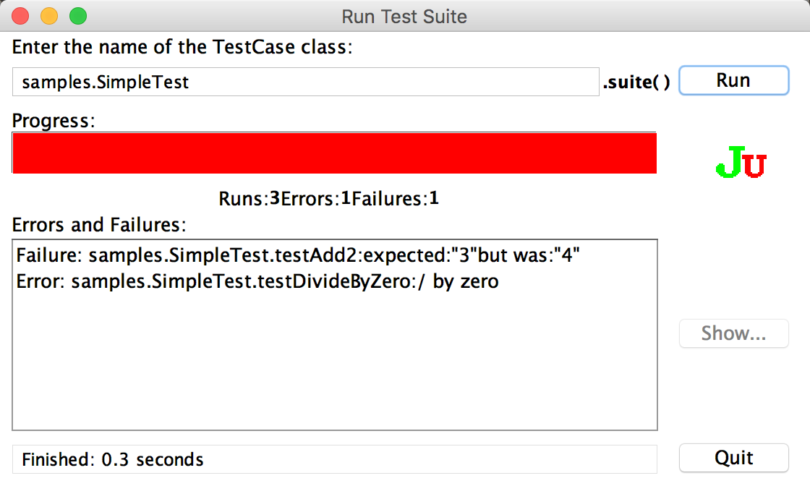

## 源码获取

现在很难找到 junit 1.0 的代码了，官网和 Github 上的代码都是 4.0 起步的。经过 Google 搜索，发现一个大学的网站上还有 junit 1.0 的代码。地址是 http://www.eg.bucknell.edu/~cs475/F2000-S2001/hyde/JUnit/

## 文件夹结构

|文件夹名称|内容|
|:--|:--|
|doc|文档|
|javadoc|api文档|
|samples|例子|
|test|junit 源码|
|test.jar|junit 的 jar 包|

## 使用方法

假设要测试三个测试

- 1 + 1 是否等于 2 
- 1 + 2 是否等于 4
- 一个数字除以 0

### 1. 继承 test.framework.TestCase

首先创建一个类 `SimpleTest`，继承 `test.framework.TestCase`

```java
package samples;

import test.framework.*;

public class SimpleTest extends TestCase {

    public SimpleTest(String name) {
        super(name);
    }
}
```

### 2. 编写测试方法

然后是编写测试方法

```java
/**
 * 1 + 1 是否等于 2 的测试
 * 
 */
public void testAdd() {
    assertEquals(1 + 1, 2);
}

/**
 * 1 + 2 是否等于 4 的测试
 */
public void testAdd2() {
    assertEquals(1 + 2, 4);
}

/**
 * 数字除 0
 */
public void testDivideByZero() {
    int zero= 0;
    int result= 8 / zero;
}
```

### 3. 提供一个名为 `suite()` 的静态方法

提供一个名为 `suite()` 的静态方法，在方法体里面加入要测试的方法的方法名即可

```java
public static Test suite() {
    TestSuite suite= new TestSuite();

    suite.addTest(new SimpleTest("testAdd"));
    suite.addTest(new SimpleTest("testAdd2"));
    suite.addTest(new SimpleTest("testDivideByZero"));

    return suite;
}
```
### 4. 启动测试：

添加一个 `main` 方法，然后调用 `TestRunner` 把类的完全限定名传入即可

```java
public static void main(String[] args) {
    test.textui.TestRunner.main(new String[]{"samples.SimpleTest"});
}
```

### 5. 测试报告

运行 `main` 方法，即可得到测试报告

```
..F.E

Time: 0.3

!!!FAILURES!!!
Test Results:
Run: 3 Failures: 1 Errors: 1
There was 1 error:
1) samples.SimpleTest.testDivideByZero
java.lang.ArithmeticException: / by zero
	at samples.SimpleTest.testDivideByZero(SimpleTest.java:41)
	at sun.reflect.NativeMethodAccessorImpl.invoke0(Native Method)
	at sun.reflect.NativeMethodAccessorImpl.invoke(NativeMethodAccessorImpl.java:62)
	at sun.reflect.DelegatingMethodAccessorImpl.invoke(DelegatingMethodAccessorImpl.java:43)
	at java.lang.reflect.Method.invoke(Method.java:498)
	at test.framework.TestCase.runTest(TestCase.java:218)
	at test.framework.TestCase.run(TestCase.java:184)
	at test.framework.TestSuite.run(TestSuite.java:30)
	at test.textui.TestRunner.run(TestRunner.java:81)
	at test.textui.TestRunner.main(TestRunner.java:61)
	at samples.SimpleTest.main(SimpleTest.java:84)
There was 1 failure:
1) samples.SimpleTest.testAdd2 "expected:"3"but was:"4""
```

如果使用 `test.tui.TestRunner` 可以得到一个图形化的测试报告

```java
public static void main(String[] args) {
    test.tui.TestRunner.main(new String[]{"samples.SimpleTest"});
}
```



## 源码结构

源码总共分为 3 个 package

- framework
- textui
- ui

framework 用来放 junit 的核心源码。textui 是放基于控制台输出的测试报告的报告输出代码。ui 是放基于图形化界面的测试报告的报告输出代码

## 主要的类

|类名|作用|
|:--|:--|
|TestRunner|测试启动类|
|Test|测试用例接口定义类|
|TestCase|测试用例接口实现类|
|TestSuite|测试用例容器|
|TestResult|测试结果|
|TestFailure|测试错误结果的包装类|
|AssertionFailedError|测试异常|

## 继承关系

class TestRunner extends Object
interface Test
abstract class TestCase implements Test
class TestSuite implements Test
class TestResult extends Object
class AssertionFailedError extends Error

## 执行流程

以 `SimpleTest` 为例

调用 `test.textui.TestRunner.main(new String[]{"samples.SimpleTest"})`方法，在方法内部，做了 3 个操作：

1. 根据传入的完整类名 `"samples.SimpleTest"` 找到该类
2. 再找到该类的名为 `suite` 的静态方法
3. 调用 `suite` 的静态方法启动测试

`TestRunner.main()` 代码如下（稍微精简了一下）

```java
public static void main(String argv[]) {
    try {
        Class testClass= null;
        Method suiteMethod= null;
        Test suite= null;

        try {
            // 找到 SimpleTest 类
            testClass= Class.forName(testCase);
        } catch(Exception e) {
            System.out.println("Suite class \""+testCase+"\" not found");
            return;
        }

        try {
            // 找到 suite 方法
            suiteMethod= testClass.getMethod("suite", new Class[0]);
        } catch(Exception e) {
            System.out.println("The suite class should have a method named \"suite()\"");
            return;
        }

        try {
            // 调用 suite 方法，获取测试用例
            suite= (Test)suiteMethod.invoke(null, new Class[0]); // static method
        } catch(Exception e) {
            System.out.println("Could not invoke the suite() method");
            return;
        }
        // 执行测试用例
        run(suite);
    } catch(Exception e) {
        System.out.println("Could not create and run test suite");
    }
}
```

核心代码就是

```java
// 执行测试用例
run(suite);
```

方法体如下

```java
public static void run(Test suite) {
    TestResult result= new TestResult();
    long startTime= System.currentTimeMillis();

    // 运行测试用例
    suite.run(result);

    // ---- 打印测试报告 ---
    long endTime= System.currentTimeMillis();
    long runTime= endTime-startTime;
    System.out.println();
    System.out.println("Time: "+runTime/1000+"."+runTime%1000);
    result.print();
    // ---- 打印测试报告 ---
}
```

`suite.run(result)` 就是遍历所有的测试用例

```java
public class TestSuite implements Test {

    public void run(TestResult result) {
        for (Enumeration e= fTests.elements(); e.hasMoreElements(); ) {
            Test test= (Test)e.nextElement();
            test.run(result);
        }
    }
}
```

执行测试用例 `TestCase` 的 `run()` 方法

```java
public abstract class TestCase implements Test {

    public void run(TestResult result) {
        // 测试执行前的初始化操作
        setUp();

        try {
            // 执行测试
            runTest();
        } catch (AssertionFailedError e) {
            // 测试不通过
            result.addFailure(this, e);
        } catch (Throwable e) {
            // 测试时抛出异常
            result.addError(this, e);
        }

        // 测试完成后的资源回收操作
        tearDown();
    }
}
```

重头戏是在

```java
// 执行测试
runTest();
```

要明白这个方法就要回到之前在 `SimpleTest` 提供一个名为 `suite()` 的静态方法

```java
public static Test suite() {
    TestSuite suite= new TestSuite();

    suite.addTest(new SimpleTest("testAdd"));
    suite.addTest(new SimpleTest("testAdd2"));
    suite.addTest(new SimpleTest("testDivideByZero"));

    return suite;
}
```

其中通过指定方法名传入到 `TestSuit` 测试用例容器中

```java
suite.addTest(new SimpleTest("testAdd"));
suite.addTest(new SimpleTest("testAdd2"));
suite.addTest(new SimpleTest("testDivideByZero"));
```

这里的方法名就会在 `TestCase` 的 `runTest()` 方法中用到。现在来看一下 `runTest()` 方法的方法体

```java
public abstract class TestCase implements Test {

    // 要测试的方法的方法名
    private final String fName;

    /**
     * 通过构造方法传入方法名
     */
    public TestCase(String name) {
		fName= name;
	}

    protected void runTest() throws Throwable {
        // 利用反射，根据 fName 获取到测试方法
        Method runMethod = getClass().getMethod(fName, new Class[0]);
        // 执行测试方法
        runMethod.invoke(this, new Class[0]);
    }
}
```

可以看到这个方法就做了两件事：

- 利用反射获取测试方法
- 调用测试方法

## 代码执行流程总结

通过上面的分析，现在总结一下：

- 用户自定义类继承 `TestCase`
- 用户编写测试方法
- 在静态方法中 `suite()` 将测试用例让入测试用例容器 `TestSuite` 中
- `TestRunner` 调用自定义类的 `suite()` 方法获取测试用例
- 遍历测试用例，执行测试用例指定的测试方法
- 打印测试报告

## 自己实现一个 junit 1.0

为了学习，我对官方的代码进行精简，抽出重要的部分，自己实现了一个 junit。

源码在 `src` 文件夹中。核心代码在 `com.okada.junit` 包中，测试代码在 `test` 包中。运行 `test` 包中的 `MathTest` 即可得到一份测试报告